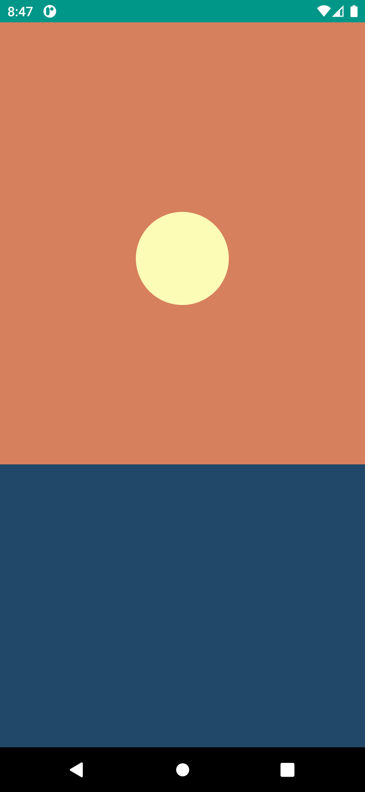
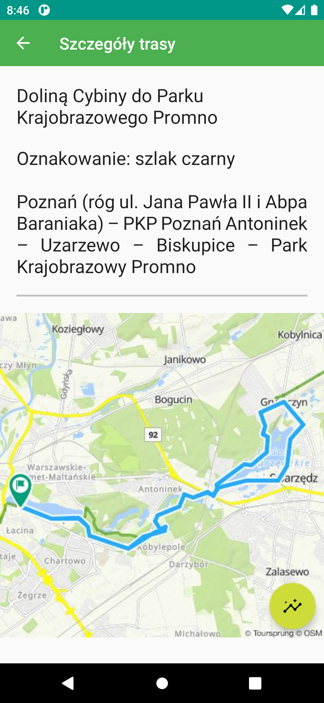
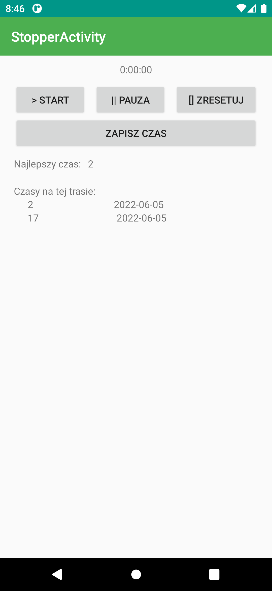
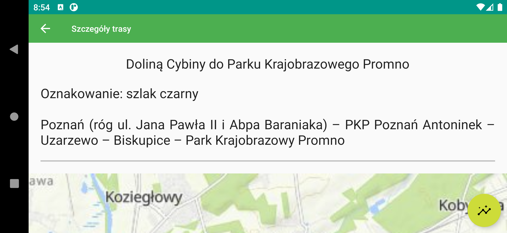
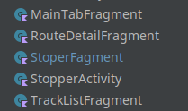
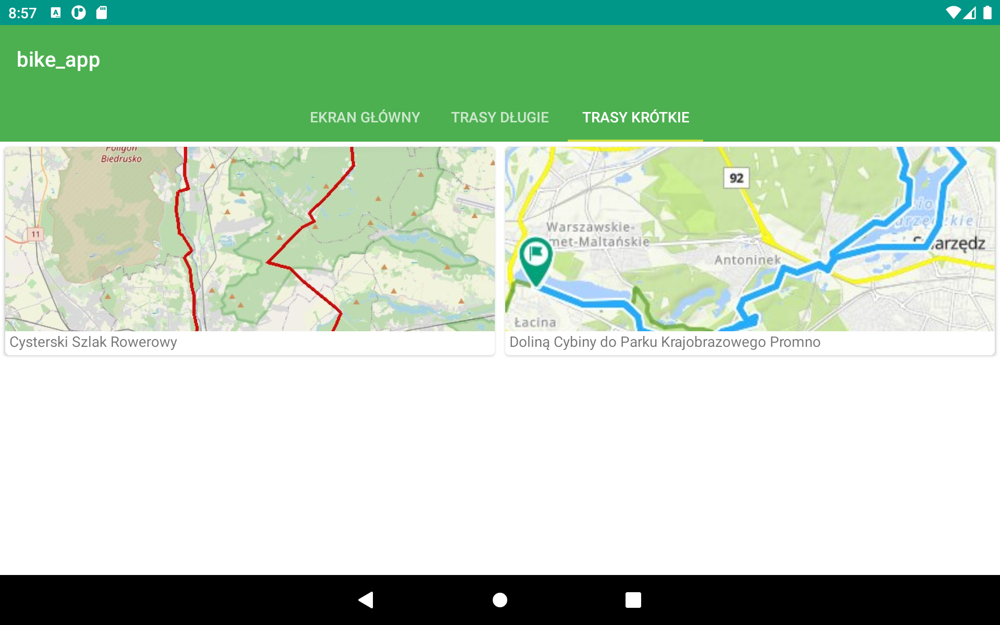

# Aplikacja Rowerowa
Anna Panfil 145233
</br>gr. L8

---

Aplikacja napisana w kotlinie w ramach zajęć z aplikacji mobilnych na Politechnice Poznańskiej. Obsługuje trasy rowerowe w okolicach Poznania.

## Ekran powitalny
Na ekranie powitalnym wyświetla się animacja zachodzącego słońca.
Słońce porusza się w dół, zmieniają się też kolory nieba. 

<!--  -->


*Zmiana kolorów nieba:*
```kotlin
val sunsetSkyAnimator = ObjectAnimator
    .ofInt(mSkyView!!, "BackgroundColor", mBlueSkyColor!!, mSunsetSkyColor!!)
    .setDuration(1000)
sunsetSkyAnimator.setEvaluator(ArgbEvaluator())
```


## Ekran główny

Po animacji przechodzimy do głównej aktywności.


W górnej części ekranu znajduje się pasek aplikacji w postaci paska narzędzi.  

*Układ paska aplikacji:*
```xml
<androidx.appcompat.widget.Toolbar xmlns:android="http://schemas.android.com/apk/res/android"
android:layout_width="match_parent"
android:layout_height="?attr/actionBarSize"
xmlns:app="http://schemas.android.com/apk/res-auto"
android:background="?attr/colorPrimary"
android:theme="@style/ThemeOverlay.AppCompat.Dark.ActionBar"
app:layout_scrollFlags="scroll|enterAlways" />
```

*Obsługa paska aplikacji:*
```kotlin
setSupportActionBar(toolbar)
pager.adapter = pagerAdapter

val tabLayout = findViewById<TabLayout>(R.id.tabs)
tabLayout.setupWithViewPager(pager)
```

Poniżej widzimy trzy karty: z powitaniem użytkownika, trasami długimi i krótkimi.

Karty obsługiwane są przez adapter, zwracający odpowiednie fragmenty w zależności od wybranej karty. Karty można zmieniać klikając na ich tytuły lub gestem przesunięcia w lewo lub prawo.

*Kod z SectionsPagerAdaptera, odpowiadający za zwrócenie odpowiedniego fragmentu:*
```kotlin
when(position){
    0 -> return MainTabFragment()
    1 -> return TrackListFragment("long")
    2 -> return TrackListFragment("short")
}
```

## Lista tras

Dane o trasach i ich statystykach przechowywane są w lokalnej bazie danych. Zdjęcia również są zapisane lokalnie i mają nazwy odpowiadające nazwom tras (bez polskich znaków, wielkich liter i spacji).

Na podstawie danych z bazy tworzony jest widok (`RecyclerView` z układem siatki) podpisanych obrazków tras. Każdej trasie odpowiada osobne `CardView` z opisem i obrazkiem.

*Dodawanie obiektów do widoku:*

```kotlin
for (i in routes.indices){
        names[i] = routes[i].name
        val name = names[i]!!.lowercase().replace(" ", "_").normalize()
        images[i] = resources.getIdentifier(name, "drawable", context?.packageName)
    }

    val routeRecycler: RecyclerView = inflater.inflate(R.layout.short_track_list, container, false) as RecyclerView

    val adapter = CaptionedImagesAdapter(names, images)
    routeRecycler.adapter = adapter
    val layoutManager = GridLayoutManager(activity, 2)
    routeRecycler.layoutManager = layoutManager
```
`CaptionedmagesAdapter` odpowiada za przypisanie odpowiedniego obrazka i tekstu do szablonu. 

Na pasku aktywności znajduje się przycisk umożliwiający powrót do poprzedniego ekranu.

*Umożliwienie cofnięcia się do poprzedniego ekranu:*
```kotlin
val actionBar = supportActionBar
actionBar?.setDisplayHomeAsUpEnabled(true)
```


## Szczegóły tras

Po kliknięciu w wybraną trasę, wyświetlają się jej szczegóły – przebieg trasy i większy obrazek. Szczegóły również są pobierane z bazy danych.

*Metoda do pobierania szczegółów tras z bazy danych:*
```kotlin
fun getDetails(id: Long): String{
    val selectQuery = "SELECT $COL_DESCR, $COL_TRACK FROM $TABLE_ROUTES WHERE $COL_ID=$id"
    val db = this.writableDatabase
    var details = "Wrong id. No details here"

    val cursor =  db.rawQuery(selectQuery, null)
    if(cursor.moveToFirst()){
        details =  cursor.getString(cursor.getColumnIndexOrThrow(COL_DESCR)) + "\n\n" + cursor.getString(cursor.getColumnIndexOrThrow(COL_TRACK))
    }
    cursor.close()
    db.close()
    return details
}
```



Szczegóły można przewijać, dzięki zastowowaniu `CoordinatorLayout` i `NestedScrollView`.

Na ekranie znajduje się również przycisk FAB umożliwiający wyświetlenie statystyk trasy i stopera.

## Statystyki trasy i stoper
*Działanie stopera:*
```kotlin
private fun runStoper(view: View){
    val timeView = view.findViewById<TextView>(R.id.tv_time)
    val handler = Handler(getMainLooper())
    handler.post {
        val hours = seconds/3600
        val minutes = (seconds % 3600)/60
        val secs = seconds % 60
        val time = String.format("%d:%02d:%02d", hours, minutes, secs)
        timeView.text = time
        if (running){
            seconds++
        }
        handler.postDelayed({runStoper(view)}, 1000)
    }
}
```



Stoper posiada przyciski start, pauza, reset oraz zapis.
Kliknięcie tego ostatniego zapisuje aktualny stan stopera do bazy danych 
(z aktualną datą), resetuje stoper i uaktualnia statystyki.

*Działanie przycisku "zapisz":*
```kotlin
private fun onClickSave(){
    Log.d("DEBUG", "Save time $trackId $seconds")
    onClickPause()
    val dbHelper = DBHelper(requireContext())
    dbHelper.insertTime(trackId!!, seconds)
    showResults(dbHelper)
    onClickReset()
}
```

W statystykach znajdziemy najkrótszy czas, w którym przejechaliśmy daną trasę oraz spis wszystkich zarejestrowanych czasów. Są one wyświetlane w widoku listy.

*Wyświetlenie listy czasów:*
```kotlin
val records: ArrayList<Record> = dbHelper.getTimes(trackId!!)

    recordAdapter = RecordAdapter(mutableListOf())

    val messageList = view?.findViewById<RecyclerView>(R.id.rv_records)
    messageList?.adapter = recordAdapter
    messageList?.layoutManager = LinearLayoutManager(requireContext())

    for(record in records) {
        recordAdapter.addRecord(record)
    }
```


## Pozostałe funkcjonalności

### Obrót urządzenia


Aplikacja działa również po obrocie urządzenia. W każdej aktywności zadbano o zapis bieżącego stanu. 

*Metoda z fragmentu StopperFragment odpowiadająca za zapisanie bieżącego stanu:*
```kotlin
override fun onSaveInstanceState(outState: Bundle) {
    super.onSaveInstanceState(outState)
    outState.putInt("seconds", seconds)
    outState.putBoolean("running", running)
    outState.putBoolean("wasRunning", wasRunning)
    outState.putLong("trackId", trackId!!)
}
```
### Motywy
Aplikacja ma dedykowane motywy.

*Ustawienia głównego motywu:*
```xml
<style name="Theme.Bike_app" parent="Theme.MaterialComponents.DayNight.DarkActionBar">
    <!-- Primary brand color. -->
    <item name="colorPrimary">@color/purple_500</item>
    <item name="colorPrimaryVariant">@color/purple_700</item>
    <item name="colorOnPrimary">@color/white</item>
    [...]
    <item name="android:statusBarColor" tools:targetApi="l">?attr/colorPrimaryVariant</item>
</style>
```

### Fragmenty
W kodzie aplikacji znajdziemy osobne fragmenty dla powitania, listy tras, szczegółów trasy i stopera.



### Obsługiwane urządzenia
Aplikacja działa również na tabletach.


